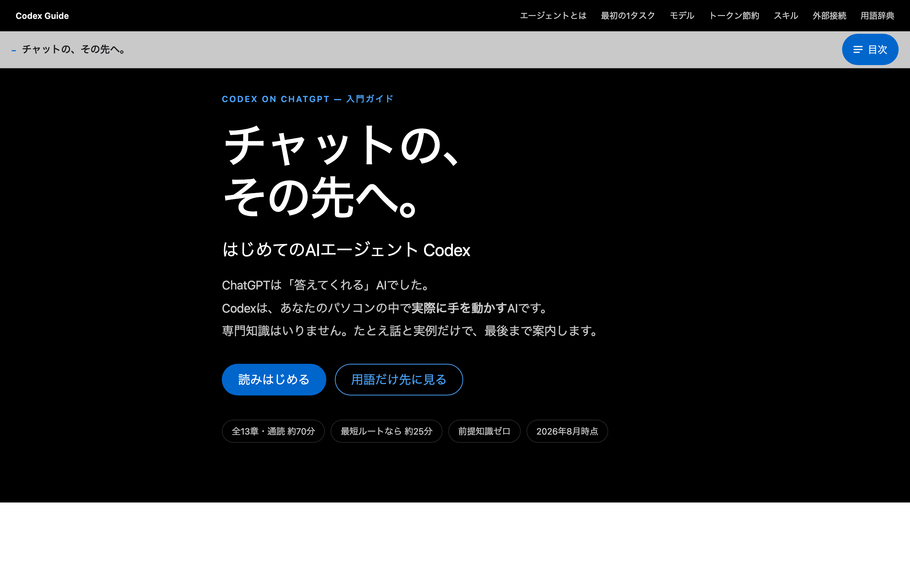
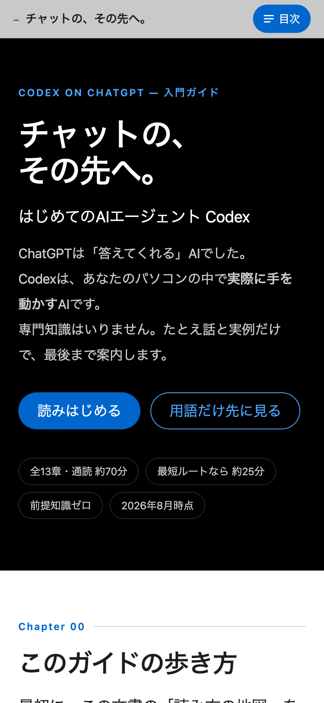

# チャットの、その先へ。— はじめてのAIエージェント Codex

ChatGPT デスクトップアプリ上で **Codex** をはじめる人のための、日本語の入門ガイドです。
プログラミング経験ゼロの読者を想定し、専門用語はすべてその場で身近なたとえに置き換えて説明しています。

📖 **[ガイドを読む](https://hugesesame.github.io/codex-desktop-app-guide/)**

<p align="center">
  <a href="https://hugesesame.github.io/codex-desktop-app-guide/">
    
    
  </a>
</p>

---

## 特徴

- **全13章**（通読 約70分／最短ルートなら約25分）
- **前提知識ゼロ** — プログラミングもコマンド操作も不要
- 各章末に **「ここだけ覚えて」** のまとめ
- 難しい話は折りたたみの「深掘り」へ。**開かなくても本筋は完結**します
- **単一HTMLファイル・外部依存ゼロ** — オフラインでも完全に動作します
- スマートフォンでの閲覧を主軸にしたレスポンシブ設計

## 目次

| # | 章 | |
|---|---|---|
| 00 | このガイドの歩き方 | |
| 01 | チャットとエージェントは何が違う？ | |
| 02 | インストールと最初の起動 | |
| 03 | はじめての1タスク（＋音声入力） | |
| 04 | AIはどこで動いている？（ローカルとクラウド） | |
| 05 | タスクとプロジェクト | |
| 06 | モデル ― AIの「頭脳」を選ぶ | 応用 |
| 07 | コンテキストとトークン・節約術 | |
| 08 | スキルと AGENTS.md | |
| 09 | 外部接続 ― MCPとプラグイン | 応用 |
| 10 | スケジュール化（自動化） | |
| 11 | 安全に使うコツとつまずき集 | |
| 12 | 用語ミニ辞典＆チートシート | |

## 読み方

| ルート | 読む章 | 目安 | ここまでで、できること |
|---|---|---|---|
| ① 最短 | 0 → 1 → 2 → 3 → 11 | 約25分 | 今日から、安全に触りはじめられる |
| ② 標準 | ① ＋ 4・5・7 | 約45分 | 仕事で、継続的に使える |
| ③ 全部 | ② ＋ 6・8・9・10 | 約70分 | 使いこなせる。自動化まで届く |

## ローカルで見る

```bash
git clone https://github.com/hugesesame/codex-desktop-app-guide.git
open codex-desktop-app-guide/index.html
```

ビルド不要です。`index.html` をブラウザで開くだけで動きます。

## 情報の鮮度について

記載内容は **2026年8月時点** のものです。Codex は更新が非常に速い領域のため、
機能名・画面構成・利用上限などは変更される可能性があります。
本ガイドは画面の細部よりも「考え方」が残るよう構成していますが、
実際の操作前に公式情報での確認をおすすめします。

主な参照元は、ガイド末尾に一覧を掲載しています。

## 免責

本ページは **OpenAI 社の公式資料ではありません**。個人が学習用にまとめた非公式の解説です。
実際の利用にあたっては、所属組織の規程および各サービスの利用規約に従ってください。
本ページの情報にもとづく操作の結果について、作成者は責任を負いかねます。

## ライセンス

文章・コードともに [CC BY 4.0](https://creativecommons.org/licenses/by/4.0/deed.ja) とします（全文は [LICENSE](LICENSE)）。
出典を明示していただければ、営利目的を含め、自由に引用・改変・再配布して構いません。

クレジットの表記例:

```
「チャットの、その先へ。— はじめてのAIエージェント Codex」(hugesesame) / CC BY 4.0
https://hugesesame.github.io/codex-desktop-app-guide/
```
